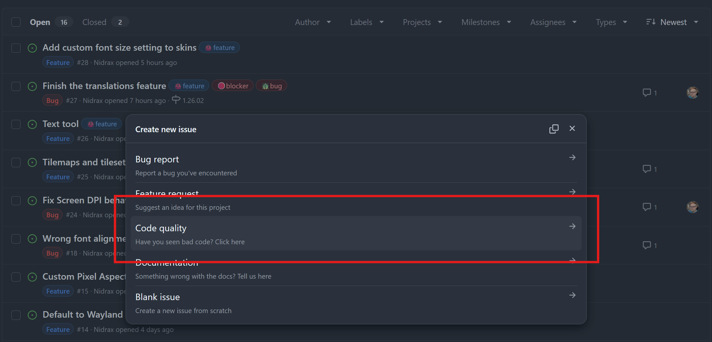
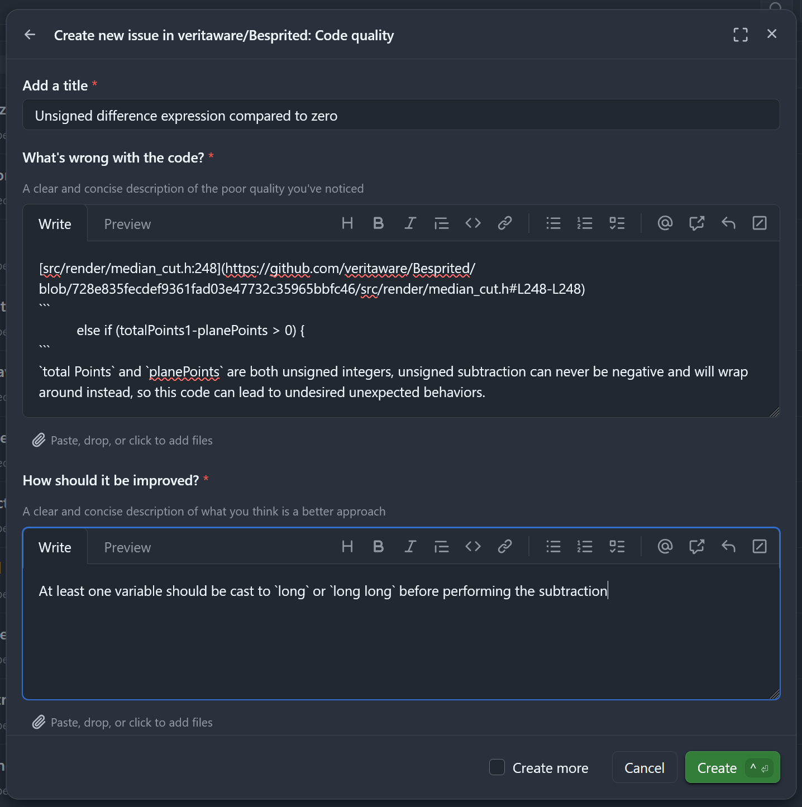
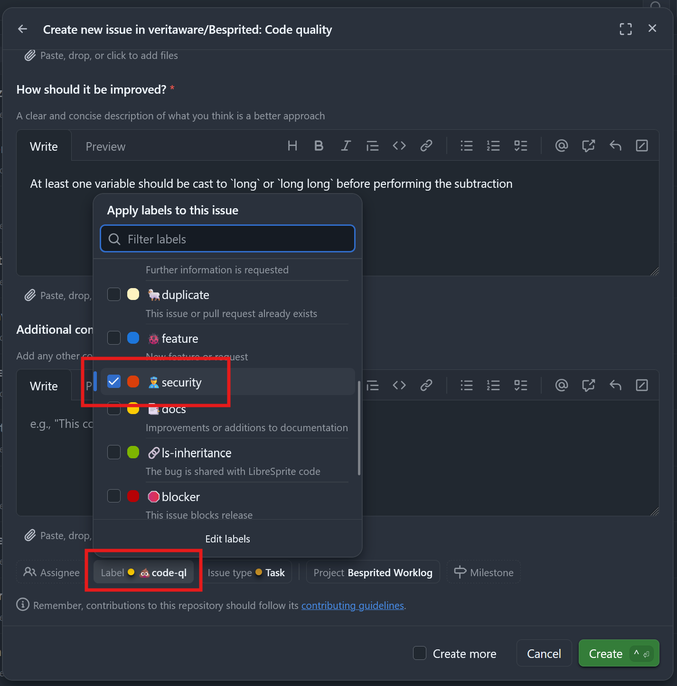

# Security Policy

## Supported Versions

| Version | Supported          |
|---------| ------------------ |
| 1.26.x  | :white_check_mark: |

## Reporting a Vulnerability

For reporting a security vulnerability, go to the [Issues page](https://github.com/veritaware/Besprited/issues),
click "New Issue", and select the "Code quality" template.

Please provide as much detail as possible, including the lines of code that are vulnerable,
and any relevant technical information about the vulnerability.

Remeber to add the `👮security` label to the issue before creating the ticket so it can be easily tracked.

